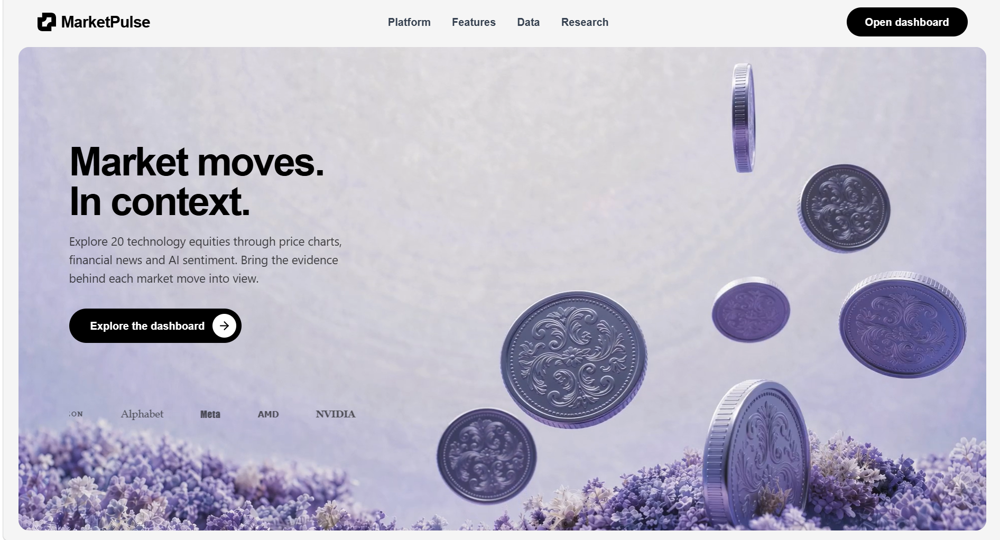
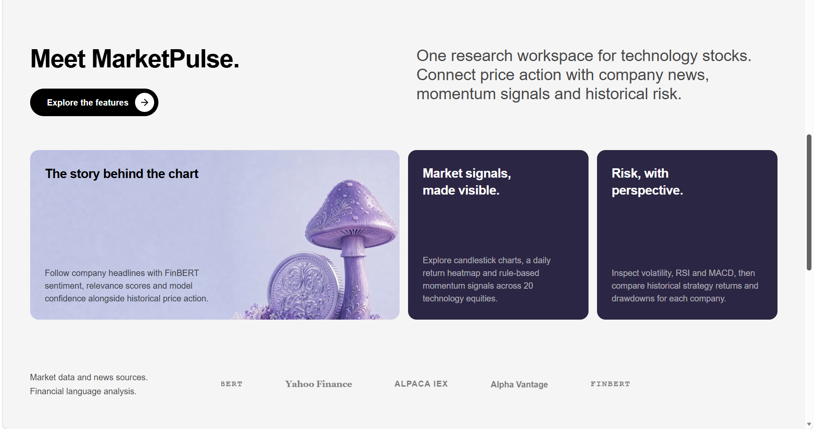
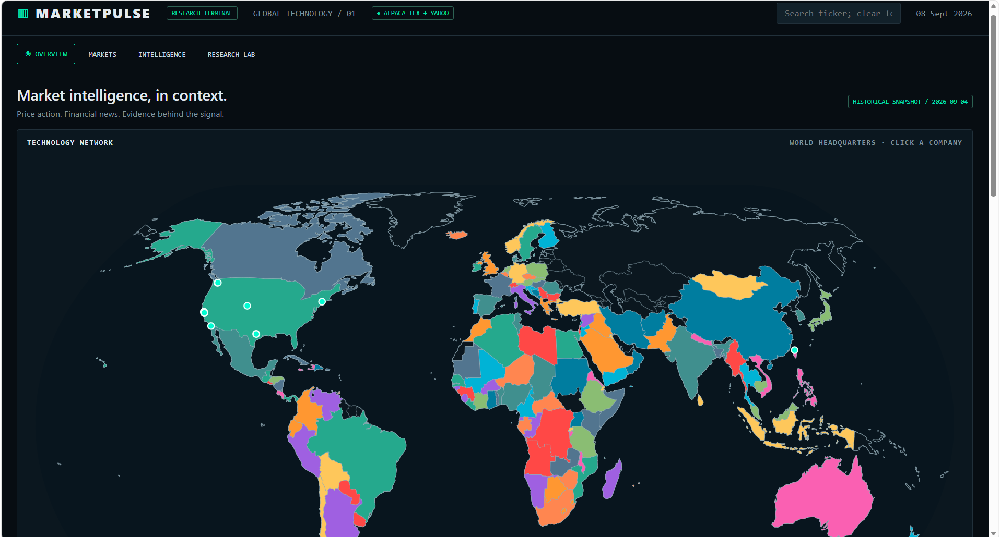
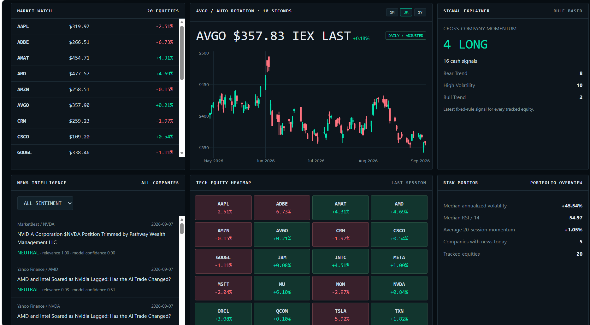
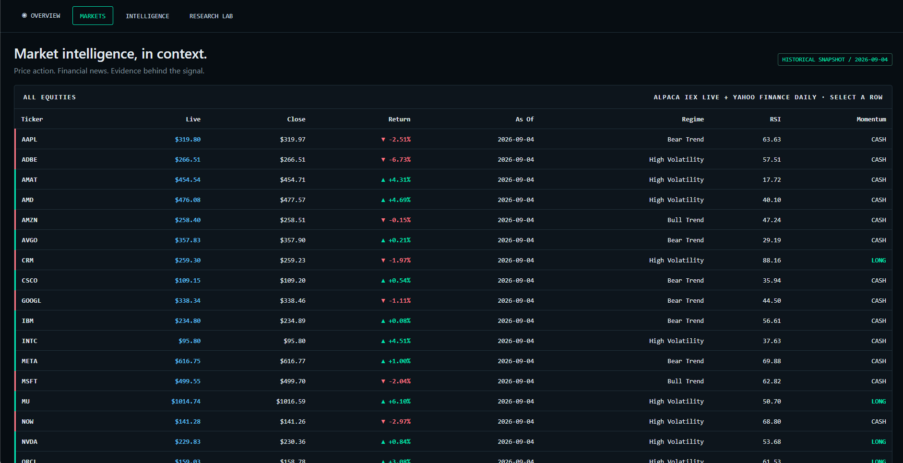
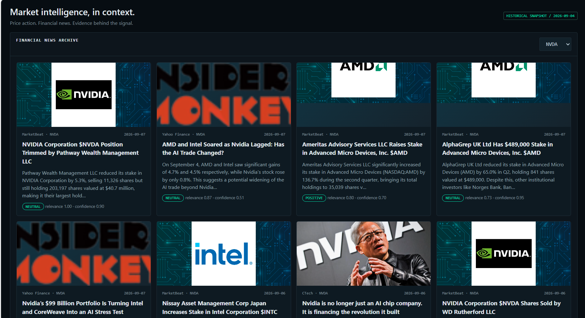
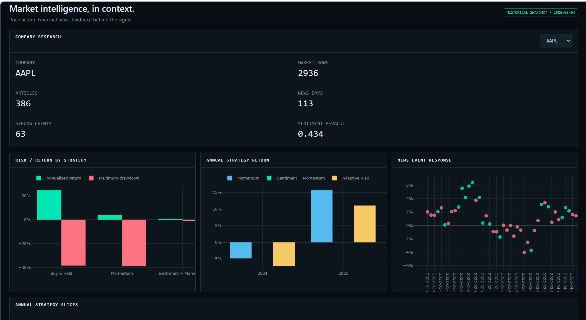

# MarketPulse

MarketPulse is a technology-equity research platform that combines historical Yahoo Finance prices, Alpaca IEX snapshots, Alpha Vantage financial news and FinBERT sentiment. It helps researchers inspect market regimes, momentum signals, news events, risk and historical strategy performance across 20 technology companies.

**[Open the live website](https://aritro123456.github.io/Market_Pulse/)** · **[Launch the dashboard](https://aritro123456.github.io/Market_Pulse/terminal.html)**

> The GitHub Pages demo uses the embedded historical research snapshot. Run the local Python server to enable the Alpaca IEX endpoint; API credentials are never exposed in the browser or repository.

## Product preview

### Landing page

The recruiter-facing landing page introduces the research problem, data sources and dashboard capabilities.





### Global technology overview

The interactive headquarters map opens company-specific research, while the overview combines a rotating price chart, watchlist, market heatmap, signals and portfolio risk indicators.





### Market data and news intelligence

The market table combines Alpaca IEX snapshots with Yahoo Finance daily history and derived indicators. The news archive presents source imagery, article summaries, relevance scores and FinBERT sentiment.





### Company research lab

Each company has its own coverage summary, strategy risk/return comparison, annual validation results and event-response visualization.



## Main capabilities

- Twenty technology equities with more than 50,000 daily market observations.
- Company-level price charts, returns, moving averages, momentum, volatility, RSI and MACD.
- Financial-news ingestion with relevance filtering, caching and rate-limit handling.
- FinBERT sentiment, daily aggregation and categorized company-news events.
- Momentum, sentiment-plus-momentum and adaptive-risk backtests with transaction costs.
- Walk-forward evaluation, information coefficients, significance tests, drawdowns and bootstrap risk analysis.
- Interactive landing page and research terminal with company-specific navigation.

## Setup

```powershell
python -m venv .venv
.venv\Scripts\python -m pip install -r requirements.txt
```

The initial research universe will focus on Apple and Microsoft before adding NVIDIA, Alphabet, and Amazon.

## Yahoo Finance ingestion

```powershell
..\.venv\Scripts\python src\market_data.py
..\.venv\Scripts\python tests\test_market_data.py
```

This writes `data/raw/market_data.csv` with adjusted daily OHLCV data from 2015 onward for 19 liquid technology stocks plus QQQ. The expanded universe provides more than 50,000 market observations; company-news analysis remains limited to the five tickers collected by Alpha Vantage.

## Technical indicators

```powershell
..\.venv\Scripts\python src\indicators.py
..\.venv\Scripts\python tests\test_indicators.py
```

This writes `data/processed/market_features.csv`. Returns, moving averages, momentum, annualized volatility, volume change, RSI, MACD, and its signal line are calculated separately for each ticker. The initial rolling rows remain missing because they do not have enough history.

## Alpha Vantage company news

```powershell
$env:ALPHA_VANTAGE_API_KEY="your-key"
..\.venv\Scripts\python src\news_data.py --refresh
..\.venv\Scripts\python tests\test_news_data.py
```

This writes everything locally. A refresh makes one paced `NEWS_SENTIMENT` request each for NVDA, AMD, MSFT, META, and GOOGL, then caches the raw responses under `data/raw/alpha_vantage/`. Running without `--refresh` uses those caches and makes no API calls. Rate-limit responses use exponential backoff; a failed refresh keeps the last valid cache. The parsed dataset is `data/raw/news_data.csv`; articles below 0.70 ticker relevance are excluded.

### Resumable historical news

```powershell
$env:ALPHA_VANTAGE_API_KEY="your-key"
..\.venv\Scripts\python src\historical_news.py --max-requests 20
```

This prioritizes under-covered ticker/year cells across ten companies and quarterly windows from 2022 through September 2026. Saturated 1,000-result windows split automatically. Every completed window is cached and recorded in `collection_state.json`; later runs resume without repeating it. The default stays below Alpha Vantage's 25-request daily standard limit. Articles are retained from relevance 0.40 upward as LOW, MEDIUM, or HIGH and are deduplicated by URL and normalized title.

## FinBERT sentiment

```powershell
..\.venv\Scripts\python src\sentiment.py
..\.venv\Scripts\python tests\test_sentiment.py
```

This scores each cached headline with `ProsusAI/finbert` and writes `data/processed/news_sentiment.csv`. Daily sentiment is relevance-weighted and retains article count, confidence, and mean relevance. `news_events.csv` groups same-company, same-day stories into earnings, guidance, product, M&A, regulatory, legal, management, analyst-rating, macro, or other events.

## Combined features

```powershell
..\.venv\Scripts\python src\features.py
..\.venv\Scripts\python tests\test_features.py
```

This left-joins daily news counts and FinBERT sentiment onto each ticker's market observations and writes `data/processed/model_features.csv`. `Has_News` distinguishes no-news days from neutral-news days.

## Research hypothesis

**H1:** Positive news sentiment combined with positive five-session momentum is associated with a higher next-session return.

```powershell
..\.venv\Scripts\python src\strategy.py
..\.venv\Scripts\python tests\test_strategy.py
```

The analysis uses only ticker-days containing news, creates the target within each ticker, and writes `model_features_with_target.csv` plus `hypothesis_results.csv`. The Welch t-test measures evidence of a difference between signal and other news days; it does not establish causation.

## Regimes, strategies, and event study

```powershell
..\.venv\Scripts\python src\backtest.py
..\.venv\Scripts\python src\event_study.py
..\.venv\Scripts\python tests\test_research_pipeline.py
```

The backtest compares an equal-weight technology-stock portfolio under buy-and-hold, momentum, and sentiment-plus-momentum rules. Signals are lagged one session. The event study uses the upper and lower sentiment quartiles and measures QQQ-adjusted returns from five sessions before through five sessions after.

## Robustness validation

```powershell
..\.venv\Scripts\python src\validation.py
..\.venv\Scripts\python tests\test_validation.py
```

This produces expanding-year out-of-sample results, net returns after costs and slippage, sentiment significance tests, multi-horizon information coefficients, sentiment/volume/return shocks, regime-conditioned metrics, a volatility-sized adaptive strategy, 1,000 bootstrap paths, and a parameter-cost stress grid. News coverage begins in July 2026, so the earlier folds validate market strategies but contain no sentiment observations.

## Local recruiter report

```powershell
..\.venv\Scripts\python src\report.py
```

Open `report/index.html` locally. It contains the current coverage, event study, walk-forward validation, information coefficients, benchmark metrics, Monte Carlo results, conclusions, and limitations without Streamlit or a web server.

## Alpaca paper connection

## Local market terminal

Run `..\.venv\Scripts\python src\terminal.py` after updating the research CSVs.
For live Alpaca IEX snapshots, run `..\.venv\Scripts\python server.py` and open
`http://127.0.0.1:8000`. The browser refreshes live values every 15 seconds;
API credentials remain in the server-side `.env` file.

For deployment, run `python server.py` and configure `ALPACA_API_KEY` and
`ALPACA_SECRET_KEY` as secret environment variables. The server honors the
hosting platform's `PORT` and serves the combined `/api/market-table` endpoint.
The terminal includes company charts, news filters, a watchlist, heatmap,
signals, risk indicators, and research tables from your local datasets.
The map is a location schematic; live streaming and paper orders are not connected.

## Alpaca setup

Copy paper credentials into `.env`, then run:

```powershell
..\.venv\Scripts\python test_alpaca.py
..\.venv\Scripts\python src\live\alpaca_stream.py
```

The first command reads account details only. The second subscribes to live IEX minute bars for NVDA, AMD, MSFT, GOOGL, and META. Neither command submits an order.

## MarketPulse landing page

The React + TypeScript landing source lives in `landing/`. Run `npm ci` and `npm run build` there to update `web/index.html` and `web/landing.template.html`. Vite preserves the existing dashboard. The Python server serves both pages; the main landing page links open `/terminal.html`.

Place licensed TT Norms Pro font files in `web/fonts/tt-norms-pro-regular.woff2` and `web/fonts/tt-norms-pro-semibold.woff2`. Until supplied, the page uses its system fallback. Videos and the savings image load from the URLs in the design prompt.
